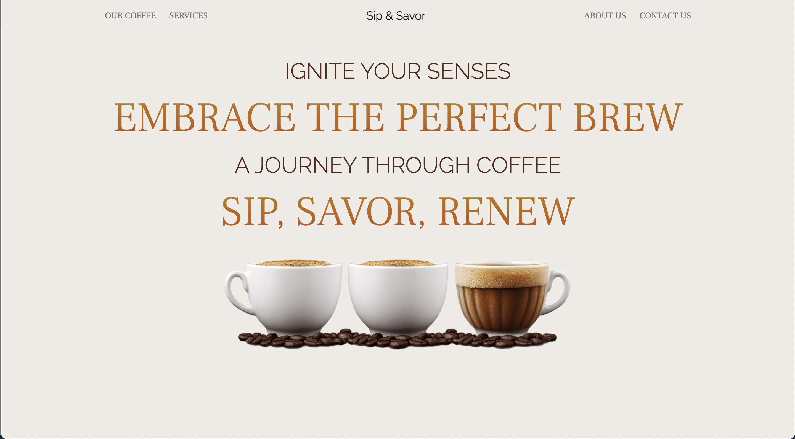

# Coffee Project

Welcome to the Coffee Project! This web-based application, centered around coffee, has been designed with an emphasis on a dynamic and engaging user interface.

One of the key features of this project is the robust search functionality that allows users to effortlessly navigate through an extensive list of coffees. Users can search by coffee name, and the results update in real-time as they type into the search bar. Additionally, there's a handy option to select roast types, further refining the search results. This responsiveness enhances the user experience by making it easy and intuitive to find the perfect brew from the variety on offer.

Aesthetically pleasing and user-friendly, the Coffee Project represents a seamless blend of design, functionality, and user experience.

 <!-- You can add a screenshot of the application -->

## Features

- **Coffee List**: Each coffee is displayed in a `div` that contains a heading displaying the coffee name and the type of roast in a paragraph.

- **Sorting**: When the page loads, the coffees are sorted by their IDs in ascending order.

- **Search**: Users can search through the coffees by name, and only the coffees that match the provided search term will be displayed.

- **Update Display**: The displayed coffee is updated as the user types into the search box or as soon as they select an option from the dropdown.

- **Additional Features**:
    - Option to select all roasts for roast type.
    - Case insensitive search.
    - Functionality to add new coffees to the page.
    - A form to input coffee name and select coffee roast. When the form is submitted, the new coffee appears on the page.

## Live Demo

Live demo of the project can be found at [Coffee Project](https://coffee-project-alpha.vercel.app/).

## Built With

- JavaScript
- HTML
- CSS
- Bootstrap

## Setup

1. Clone the repository to your local machine.
2. Navigate to the project directory.
3. Open the `index.html` file in your browser to view the application.

